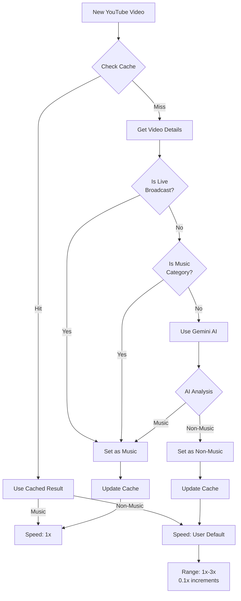
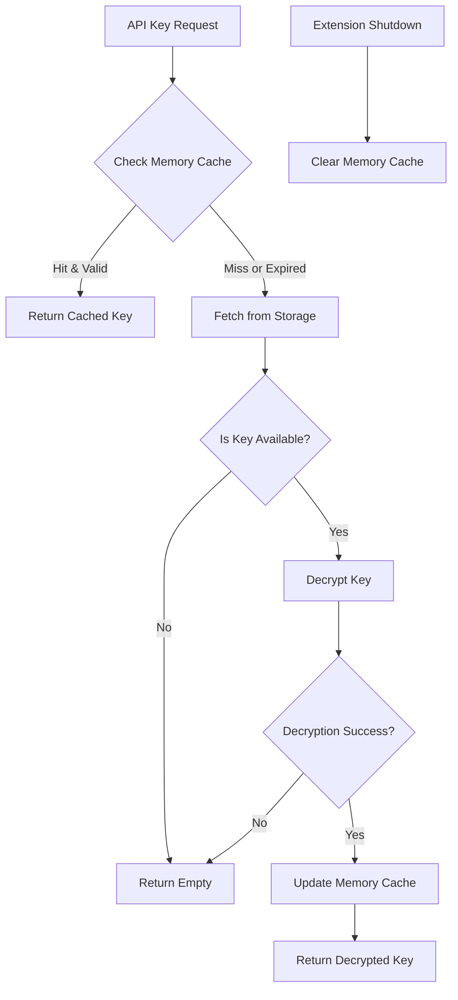

# Music x1 Technical Architecture

## Detection System Overview

The extension uses a sophisticated detection system combining YouTube's category data, live broadcast status, and AI-based content analysis.



## Security & API Key Management

The extension implements a robust security system for handling API keys with encryption and secure memory management.



1. **Secure Key Storage**:
   - API keys are never stored in plaintext
   - AES-GCM encryption with 256-bit keys
   - Unique encryption key for each stored value
   - Full encryption structure:
     ```typescript
     {
       data: Uint8Array,  // Encrypted API key
       iv: Uint8Array,    // Initialization vector
       key: Uint8Array    // Encryption key (wrapped)
     }
     ```

2. **Memory Safety Features**:
   - In-memory caching with 30-minute expiry
   - Automatic cache clearing on extension startup/shutdown
   - API keys only briefly in memory during use
   - Cache data structure:
     ```typescript
     interface KeyCache {
       value: string;     // Decrypted key
       timestamp: number; // Time when cached
     }
     ```

3. **Key Management Classes**:
   - Centralized `ApiKeyManager` class
   - Typed key enumeration for different API services
   - `crypto.ts` utility for encryption operations
   - Zero-trust approach with explicit cleanup operations

## Content Detection Details

1. **Cache-First Approach**:
   - Every video check starts with a cache lookup
   - Cache validity period: 28 days
   - Cache data structure:
     ```typescript
     interface CacheData {
       isMusic: boolean;
       timestamp: number;
       detectionMethod: 'youtube' | 'gemini';
     }
     ```
   - Benefits:
     - Zero external API calls when cache hit
     - Immediate playback speed setting
     - Reduced API quota usage

2. **Fresh Detection Flow**:
   - Triggered on cache miss or expired cache
   - Sequential detection steps:
     1. Live Broadcast Check
        - Live broadcasts automatically marked as music content
        - Prevents speed-up during live performances/streams
     2. YouTube Category Check
        - Uses YouTube Data API
        - Category ID 10 = Music content
        - Most reliable when available
     3. Gemini AI Analysis
        - Used when YouTube category is non-music/unclear
        - Analyzes video title using structured prompt
        - Handles multiple languages (JP, EN, etc.)

3. **Error Handling & Retry Logic**:
   - YouTube API:
     - Quota exceeded detection (403 response)
     - Network error recovery
     - Invalid response handling
   - Gemini API:
     - Automatic retry (up to 2 times)
     - Exponential backoff (1s, 2s delays)
     - Fallback to default speed on failure

## Visual Feedback System

The extension provides real-time feedback through the browser extension icon:

- **Icon Badge**:
  - 🎵 (Green): Music content detected
  - 🎞️ (Gray): Non-music content
  - Badge shows detection method on hover (youtube/gemini)

- **Popup Interface**:
  - Shows current content type
  - For non-music: Adjustable speed slider (1x-3x, 0.1x steps)
  - For music: Fixed at 1x with visual indicator
  - API configuration status

## Implementation Details

1. **Content Script** (`content.ts`):
   - Handles YouTube SPA navigation
   - Manages video element detection
   - Implements playback rate controls
   - Uses MutationObserver for dynamic content

2. **Background Process** (`background.ts`):
   - Manages content detection flow
   - Handles cache operations
   - Coordinates API calls
   - Updates visual indicators
   - Initializes and cleans up security components

3. **API Integrations**:
   - YouTube Data API (`youtube.ts`):
     - Video category retrieval
     - Live broadcast detection
     - Error handling with retries
     - Secure API key retrieval
   - Gemini API (`gemini.ts`):
     - Structured content analysis
     - JSON response schema
     - Retry mechanism with backoff
     - Secure API key retrieval

4. **Security Components**:
   - API Key Manager (`apiKeyManager.ts`):
     - Secure key storage and retrieval
     - Memory cache with timed expiry
     - Type-safe API key handling
   - Crypto Utilities (`crypto.ts`):
     - AES-GCM encryption/decryption
     - Binary data handling
     - Error recovery for crypto operations

5. **User Interface** (`popup.tsx` & `options.tsx`):
   - Real-time playback control
   - Visual feedback
   - Settings access
   - Responsive speed adjustment
   - Secure API key configuration

## Error Recovery

The system implements multiple layers of error recovery:

1. **API Failures**:
   - Automatic retries with backoff
   - Fallback to alternative detection methods
   - Cache utilization when APIs are unavailable

2. **Content Script**:
   - Automatic reinitialization on navigation
   - Multiple attempts for video element detection
   - Message retry mechanism for speed updates

3. **Cache Management**:
   - Graceful degradation on cache miss
   - Automatic cache cleanup
   - Cache validation before use
