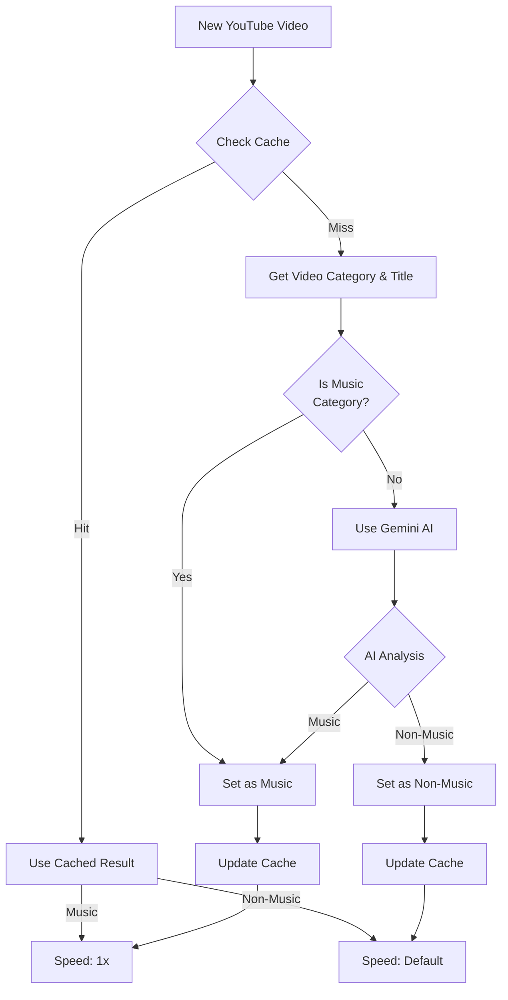

# Music x1 Chrome Extension

> [!CAUTION]
> This is an experimental Chrome extension. Use at your own risk. Features and functionality may change without notice.

A Chrome extension that automatically detects music content on YouTube using YouTube Data API and Google Gemini AI, then sets playback speed based on content type:
- For music content: Automatically sets to 1x speed for optimal listening
- For non-music content: Automatically adjusts speed between 1x and 2.5x in 0.25x increments

## How It Works

The extension uses a sophisticated detection system combining YouTube's category data and AI-based content analysis.

### Detection Flow Overview



### Content Detection Details

1. **Cache-First Approach**:
   - Every video check starts with a cache lookup
   - If valid cache exists (less than 28 days old):
     - Uses cached result directly
     - Skips all API calls (both YouTube and Gemini)
     - Immediately sets playback speed based on cached result
   - Cache includes:
     - Music/Non-music determination
     - Detection method used (youtube/gemini)
     - Timestamp for expiry checking

2. **Fresh Detection Flow** (only when cache misses):
   - First tries YouTube Data API to get video category
   - If category is "Music" (ID: 10):
     - Instantly marked as music
     - No Gemini API call needed
   - For non-music categories:
     - Uses Gemini AI to analyze video title
     - Makes final determination based on AI analysis

3. **Performance Benefits**:
   - Zero external API calls when cache hit
   - Maximum one YouTube API call per cache miss
   - Gemini API only called when needed (non-music category)
   - Significant reduction in API usage and latency

### API Keys

- **YouTube Data API Key** (Required):
  - Provides accurate video detail retrieval via YouTube Data API
  - Essential for extension functionality

- **Google Gemini API Key** (Required):
  - Used for AI-based content analysis
  - Required for core functionality
  - Used as fallback for YouTube category detection

## Installation

1. Clone this repository
```bash
git clone https://github.com/izumiz-dev/music-x1.git
```

2. Install dependencies
```bash
pnpm install
```

3. Build the extension
```bash
pnpm build
```

4. Load the extension in Chrome
- Open Chrome
- Go to `chrome://extensions/`
- Enable "Developer mode"
- Click "Load unpacked"
- Select the extension's build directory

5. Configure Google Gemini API Key
- Get your API key from Google AI Studio
- Click the extension icon in Chrome
- Open extension settings
- Enter your Gemini API key in the settings page
- Save the settings

## Development

- `pnpm dev` - Start development mode with hot reload
- `pnpm build` - Build for production

## Tech Stack

- TypeScript
- Google Gemini AI
- Preact
- esbuild
