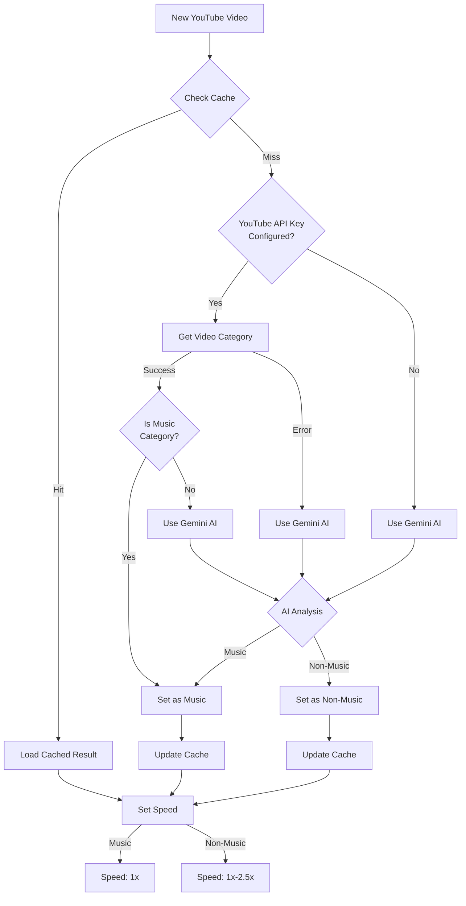

# Music x1 Chrome Extension

> [!CAUTION]
> This is an experimental Chrome extension. Use at your own risk. Features and functionality may change without notice.

A Chrome extension that automatically detects music content on YouTube using YouTube Data API and Google Gemini AI, then sets playback speed based on content type:
- For music content: Automatically sets to 1x speed for optimal listening
- For non-music content: Automatically adjusts speed between 1x and 2.5x in 0.25x increments

## How It Works

The extension uses a sophisticated detection system combining YouTube's category data and AI-based content analysis.

### Detection Flow Overview



### Content Detection Details

1. **YouTube Category-based Detection** (when YouTube API Key is configured):
   - If category is "Music" (ID: 10) → Instantly marked as music content
   - For all other categories → Further analyzed by Gemini AI

2. **Fallback to AI Detection**:
   - When YouTube API Key is not configured
   - When YouTube API requests fail
   - For entertainment category content

3. **Caching**:
   - Detection results are cached to minimize API usage
   - Cache includes both YouTube API and Gemini AI results
   - Cache stores detection method along with the result
   - Cache is keyed by video ID and expires after 28 days
   - Cache helps reduce both YouTube API quota usage and Gemini API costs

### API Keys

- **YouTube Data API Key** (Optional):
  - Enables faster category-based detection
  - Reduces Gemini AI API usage
  - Not required for basic functionality

- **Google Gemini API Key** (Required):
  - Used for AI-based content analysis
  - Required for core functionality
  - Used as fallback for YouTube category detection

## Installation

1. Clone this repository
```bash
git clone https://github.com/izumiz-dev/music-x1.git
```

2. Install dependencies
```bash
pnpm install
```

3. Build the extension
```bash
pnpm build
```

4. Load the extension in Chrome
- Open Chrome
- Go to `chrome://extensions/`
- Enable "Developer mode"
- Click "Load unpacked"
- Select the extension's build directory

5. Configure Google Gemini API Key
- Get your API key from Google AI Studio
- Click the extension icon in Chrome
- Open extension settings
- Enter your Gemini API key in the settings page
- Save the settings

## Development

- `pnpm dev` - Start development mode with hot reload
- `pnpm build` - Build for production

## Tech Stack

- TypeScript
- Google Gemini AI
- Preact
- esbuild
